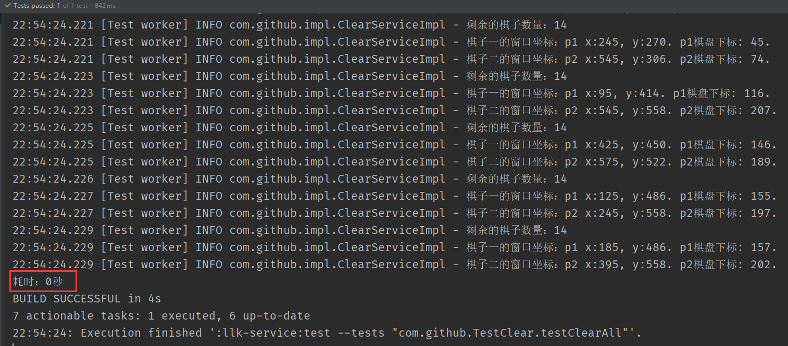

#某迅游戏大厅连连看辅助-Java版本

### 项目说明:
疫情静态管理期间闲的蛋疼，做个辅助打发时间。
顺带学习JDK11、gradle多模块、以及springBoot部分组件的单独使用等等。

### 秒杀示例:



### 功能

- 全图秒杀

- 速度调整实现

- 锁定倒计时

###原理说明
CE查找基质，JNA库读取内存，算法实现。

### 运行源码
必须[adoptOpenJDK11](https://adoptopenjdk.net/)

Gradle:
``` text
 gradle clean classes
```

### 使用方法

### 注意事项
个人学习交流，请不要用于牟利、植入广告之类的

## License
